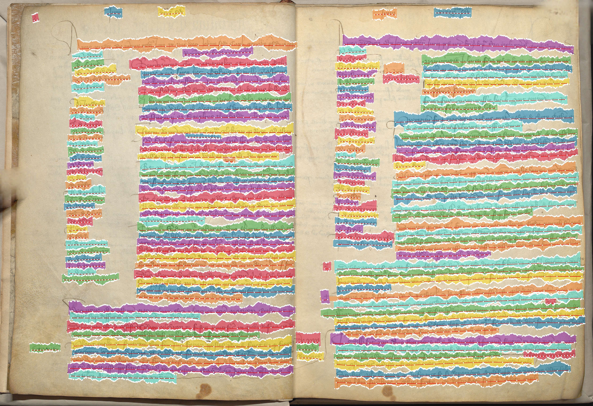
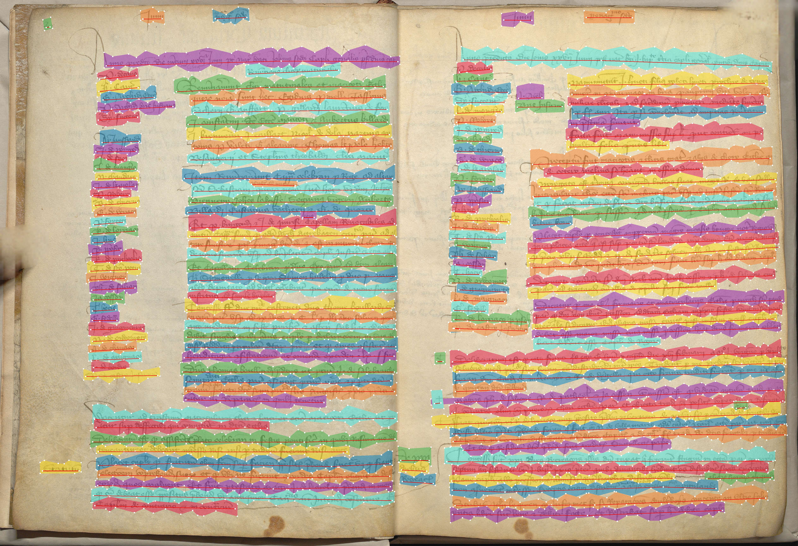
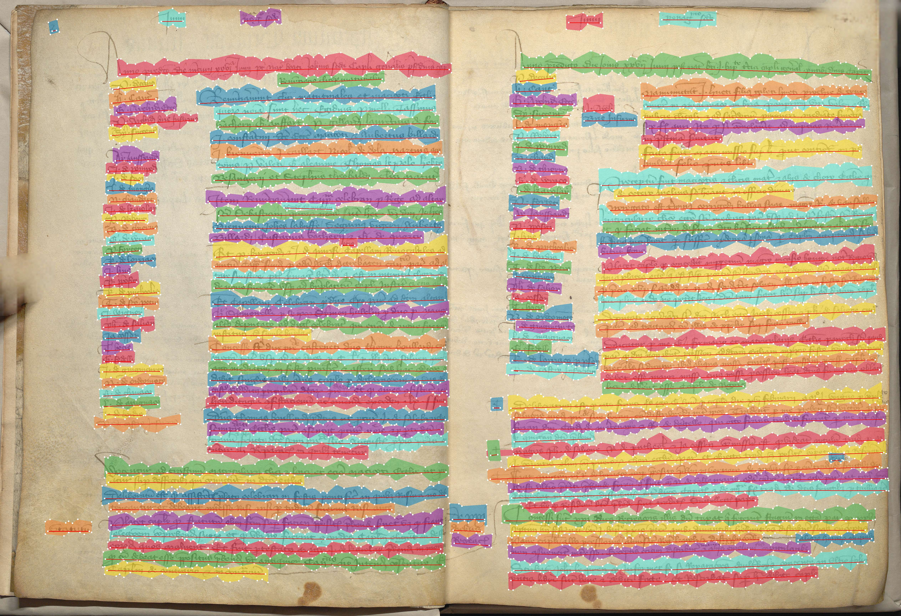
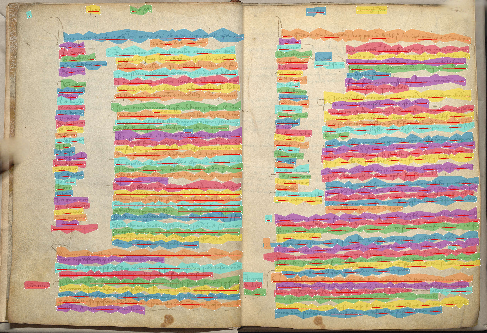

LSS (Layout Segmentation Simplifier)
====================================


## Install

`pip install https://github.com/PonteIneptique/lss/archive/refs/heads/main.zip`

or 

`pip install layouts-segmentation-simplifier`
## Use

### Generic use

```python
from lss.parsers import PageXML

file = PageXML.from_file(
    # Path to your file
    "data/0002_Main_frame.xml",
    # Optional: set-up the namespace, as they tend to change a lot
    namespace="http://schema.primaresearch.org/PAGE/gts/pagecontent/2019-07-15" 
)
# Simplify your baseline: things within 10% of your line height will be discarded (Seems to be a good number)
file.simplify_lines(ratio=.10)
# Simplify your baseline: things within 15% of your mask height will be discarded (Seems to be a good number)
file.simplify_masks(ratio=.15)
# You can retrieve the xml in file.xml or dump the modified xml in file.xml
file.dump(filepath="file.xml")

```

### Qualitatively search for best parameters

You can also get it to make multiple simulation, to chose the best value (highest ratio = bigger simplification)

```python
from lss.parsers import PageXML

page = PageXML.from_file("./data/0002_Main_frame.xml")
page.find_namespace() # Useful in case you use PageXML as it scans for the right namespace
page.test_values(
    [(.05, .05), (.1, .1), (.15, .15), (.20, .20)],
    image="./data/0002_Main_frame.jpg",
    basename_output="./data/0002_Main_frame"
)
```

In this context, lines will be simplified by a ratio of 0.05, 0.10, 0.15 and 0.20. Mask will be as well. 
Few files will be saved. Each test will create test files with overlays (cf. folder [data](./data) for all examples):

Original            |  15% ratio on both line and masks
:-------------------------:|:-------------------------:
  |  

10%            |  20%
:-------------------------:|:-------------------------:
  |  


